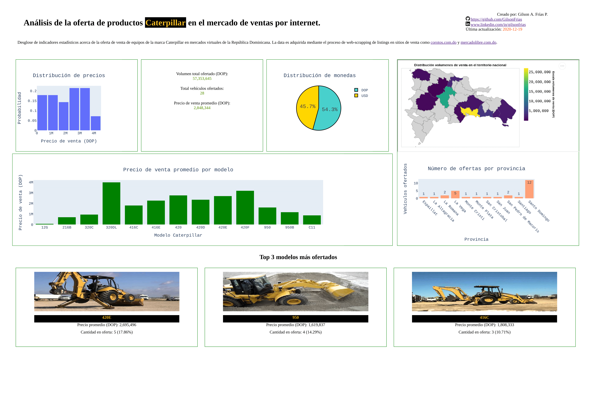

# Caterpillar e-sales Analytics Dashboard

A simple proof-of-concept dashboard created with [Plotly-Dash](https://pypi.org/project/dash/) and [Altair maps](https://pypi.org/project/altair/) designed to showcase the KPIs related to online offers of Caterpillar vehicles on the Dominican Republic. The data is gathered from online sale listings by web-scrapping with [BeautifulSoup](https://pypi.org/project/beautifulsoup4/).  

<div style="text-align:center">

</div>

## Setup

1. Clone repository: ``git clone https://github.com/GilsonFrias/caterpillar_e-sales_dashboard`` 
2. Create a new Python virtual environment: ```python3 -m venv venv```
3. Start environment: ```source venv/bin/activate```
4. Install dependencies: ```pip install -r requirements```
5. Start server: ```python wsgi.py```
6. In your browser, go to http://0.0.0.0:5000/dashapp/

In addition, you can install Jupyter (```pip install jupyter```) or use [Google Collab](https://colab.research.google.com/) to work with the *web_scrap/caterpillar_analytics.ipynb* notebook.
